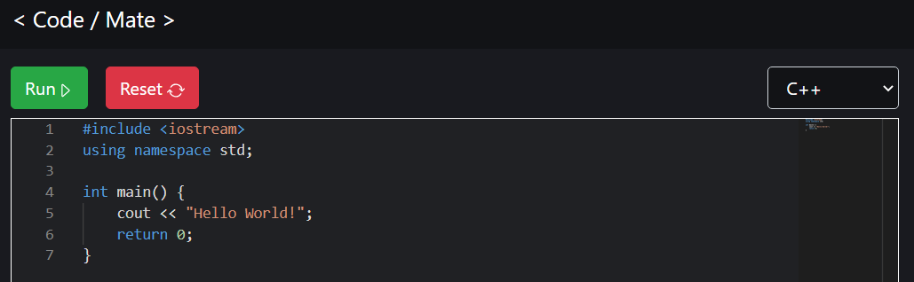

# Code Mate

## A real time code collaboration web app

This app allows two users to connect and edit code in real time. It also allows them to chat and dicusss possible solutions to a coding problem.

## Inspiration

The process of trying to help my peers debug their coding assignments remotely (through Groupme) was slow and inefficient. This web app is intended to improve that process.

## Stack
- React
- NodeJS/Express
- SocketIO
- GlotIO API

## Preview | [link](https://code-mate-site.herokuapp.com/) (might load slowly)

